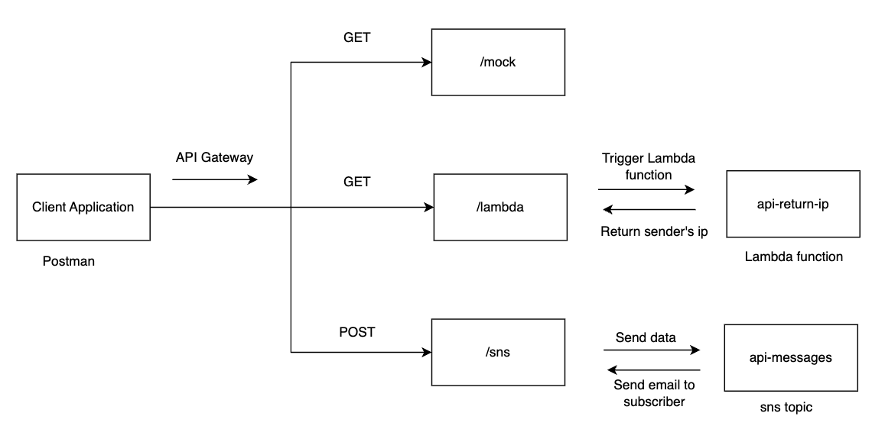

# Mini Project : Set up Api Gateway for mock, SNS and lambda

# Objective

To create REST API in order to connect API Gateway with the services like SNS and Lambda. Also. test for mock api.

[https://youtu.be/gITQzGrajJM?si=nu3g9JpMPwHS8jn7](https://youtu.be/gITQzGrajJM?si=nu3g9JpMPwHS8jn7)

# Architecture



# Requirements

An AWS Account with admin permission

# Basic Theory

## **API Gateway**

Amazon API Gateway is an AWS service for creating, publishing, maintaining, monitoring, and securing REST, HTTP, and WebSocket APIs at any scale. API developers can create APIs that access AWS or other web services, as well as data stored in the [AWS Cloud](https://aws.amazon.com/what-is-cloud-computing/). As an API Gateway API developer, you can create APIs for use in your own client applications. Or you can make your APIs available to third-party app developers.

## **Features of API Gateway**

Amazon API Gateway offers features such as the following:

- Support for stateful ([WebSocket](https://docs.aws.amazon.com/apigateway/latest/developerguide/apigateway-websocket-api.html)) and stateless ([HTTP](https://docs.aws.amazon.com/apigateway/latest/developerguide/http-api.html) and [REST](https://docs.aws.amazon.com/apigateway/latest/developerguide/apigateway-rest-api.html)) APIs.
- Powerful, flexible [authentication](https://docs.aws.amazon.com/apigateway/latest/developerguide/apigateway-control-access-to-api.html) mechanisms, such as AWS Identity and Access Management policies, Lambda authorizer functions, and Amazon Cognito user pools.
- [Canary release deployments](https://docs.aws.amazon.com/apigateway/latest/developerguide/canary-release.html) for safely rolling out changes.
- [CloudTrail](https://docs.aws.amazon.com/apigateway/latest/developerguide/cloudtrail.html) logging and monitoring of API usage and API changes.
- CloudWatch access logging and execution logging, including the ability to set alarms. For more information, see [Monitor REST API execution with Amazon CloudWatch metrics](https://docs.aws.amazon.com/apigateway/latest/developerguide/monitoring-cloudwatch.html) and [Monitor WebSocket API execution with CloudWatch metrics](https://docs.aws.amazon.com/apigateway/latest/developerguide/apigateway-websocket-api-logging.html).
- Ability to use AWS CloudFormation templates to enable API creation. For more information, see [Amazon API Gateway Resource Types Reference](https://docs.aws.amazon.com/AWSCloudFormation/latest/UserGuide/AWS_ApiGateway.html) and [Amazon API Gateway V2 Resource Types Reference](https://docs.aws.amazon.com/AWSCloudFormation/latest/UserGuide/AWS_ApiGatewayV2.html).
- Support for [custom domain names](https://docs.aws.amazon.com/apigateway/latest/developerguide/how-to-custom-domains.html).
- Integration with [AWS WAF](https://docs.aws.amazon.com/apigateway/latest/developerguide/apigateway-control-access-aws-waf.html) for protecting your APIs against common web exploits.
- Integration with [AWS X-Ray](https://docs.aws.amazon.com/apigateway/latest/developerguide/apigateway-xray.html) for understanding and triaging performance latencies.

# Procedure

1. Firstly we will create an sns topic (**api-messages)** and set the subscriber to the topic.
2. Then we will create a lambda function ( api-return-ip) that will extract the ip
3. Now we will go to Api Gateway and create an API (`my-demo-api`) with REST API (public one). 
4. Create 1st resource at /mock
5. Create a method for mock (get, integration type as mock). Then edit integration response with mapping template (application/json). Keep valid json format.
`{
  "statusCode": 200,
  "message": "This is customized mock response"
}`
6. Then create a new resource at /lambda 
7. Crate a get method for lambda (get, integration type as lambda).Then give your Lambda function name `api-return-ip`. Don’t forget to enable the lambda proxy integraion. (Permission automaticlly created for Lambda function to be invoked by API Gateway).
8. Create a role for API Gateway to invoke SNS Topic
9. Then create a new resource at /sns
10. Create a method for sns (post, integration type as aws service then choose your sns topic) and modify it such that it passes the query strings to SNS topic.
11. After setting up everything, deploy your API as a new Stage and name it as `v1` .
12. After deployment, you will be getting invoke url. Use that invoke url to test your api as following with the api testing tool (like postman)
    1. <invoke_url>/mock (get request)
    2. <invoke_url>/lambda (get request)
    3. <invoke_url>/sns (post request)
        1. Give your TopicArn and Message as Query Params

[https://youtu.be/7sJbCEj-0Xw?si=BNR10LYdfQCmyEG0](https://youtu.be/7sJbCEj-0Xw?si=BNR10LYdfQCmyEG0)

# Additional Instructions

## Creating a Lambda function that extract the ip address from a request

**Step 1: Create a Lambda Function**

1. Click on **Create function**.
2. Select **Author from scratch**.
3. Provide the following details:
    - **Function name:** `api-return-ip`
    - **Runtime:** Python 3.x (e.g., Python 3.9)
    - **Architecture**: x86_64
4. Under **Permissions**:
    - Select **Create a new role with basic Lambda permissions**.
5. Click **Create function**.

**Step 2: Add Lambda Code**

1. Once the function is created, scroll down to the **Code source** section.
2. Replace the default code with this:

```python
def lambda_handler(event, context):
    return {
        'statusCode': 200,
        'headers': {'Content-Type': 'application/json'},
        'body': event['requestContext']['identity']['sourceIp'],
        'isBase64Encoded': False
		 }
    
```

**Step 3: Add API Gateway Trigger**

1. Go to **Configuration → Triggers** tab in your Lambda function.
2. Click **Add trigger**.
3. Choose **API Gateway**.
4. Select your existing API.
5. Choose:
    - **Deployment stage** → e.g., `dev`
    - **Security** → Open or IAM-based (your choice)
6. Click **Add**.

## Creating SNS Topic and Setting the Subscriber

**Step 1: Login to AWS Console**

1. Go to [https://aws.amazon.com/](https://aws.amazon.com/) and **log in** to your AWS account.
2. From the **Services Menu**, search for **SNS** and click on **Simple Notification Service**.

**Step 2: Create a Standard SNS Topic**

1. In the left sidebar, click on **Topics**.
2. Click **Create topic**.
3. Choose **Standard** under **Type**.
4. In the **Name** field, enter a name for your topic (e.g., `API-Messages`).
5. (Optional) Add a **Display name** (only used for SMS subscriptions).
6. You can leave default settings for **Encryption**, **Access policy**, etc.
7. Click **Create topic**.
8. Your topic is created, Topic are will be useful later.

**Step 3: Add a Subscriber to the SNS Topic**

1. After creating the topic, on the **Topic details** page, scroll down to the **Subscriptions** section.
2. Click **Create subscription**.
3. In **Protocol**, select the type of subscription you want (we select Email):
    - **Email** → Sends a notification to an email address.
    - **SMS** → Sends a text message.
    - **Lambda** → Invokes an AWS Lambda function.
    - **HTTP/S** → Sends an HTTP POST request.
    - **SQS** → Sends a message to an SQS queue.
4. In **Endpoint**, enter the target address:
    - For **Email**, enter your email address.
    - For **SMS**, enter the phone number.
    - For **Lambda**, select a Lambda function.
5. Leave other settings as default and click **Create subscription**

**Step 4: Confirm Subscription**

1. You will receive a **confirmation message**.
2. For **Email**:
    - Check your email inbox.
    - Click the **Confirm subscription** link in the email.

## Creating a role for API Gateway to invoke SNS Topic

**Step 1: Go to IAM Console**

1. Log in to your AWS Console and search for and open the **IAM** service. In the left sidebar, click **Roles**.Click **Create role**.

**Step 2: Give informations**

1. **Trusted entity type:** Select **API Gateway**.Click **Next**.
2. Give role **Name** as `api-gw-sns-role`
3. Click on Create Role.

**Step 3: Create Custom Inline Policy**

1. After creating your Role, go to that role and add inline policy (json) as following.
2. Review policy and name it as `SnsPublic`
3. Then click Create Policy.
 

```json
{
	"Version": "2012-10-17",
	"Statement": [
		{
			"Effect": "Allow",
			"Action": "sns:Publish",
			"Resource": "*"
		}
	]
}
```

**Step 4: Use the Role in API Gateway Integration**

1. Go to **API Gateway**.
2. Select your API, create a Method (e.g., POST).
3. Under **Integration Request**:
    - Integration type: **AWS Service**
    - AWS Region: Your region
    - AWS Service: `SNS`
    - HTTP method: `POST`
    - Action type: Use Action name
    - Action: `Publish`
    - Execution role: Paste the **Role ARN** of the role you just created for API Gateway to access SNS.

**Step 5: Modify method request**

1. We are going to specify URL Query String Parameters. Here when api is called, this api expects following query strings.
2. Add the following Query Strings 
    1. TopicArn
    2. Message

**Step 6: Modify integration request**

1. Again we will specify URL Query String parameter. Here we will set, how data will be passed to SNS, when api is called.
2. Add the following Query String (Name → Mapped from)
    1. TopicArn → method.request.querystring.TopicArn
    2. Message → method.request.querystring.Message